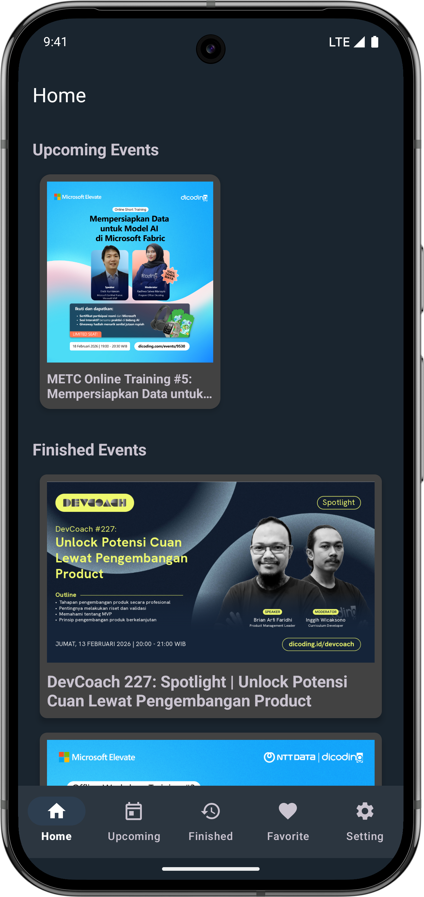
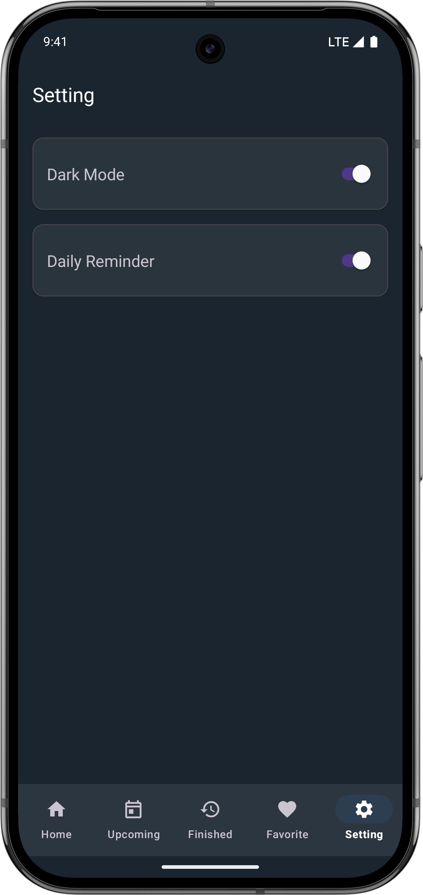

# Dicoding Event App

A comprehensive Android application for managing and discovering events, built with modern Android development practices. This project is a submission for the Dicoding Android Developer course, implemented with MVVM architecture, Clean Architecture principles, and full dark mode support.

## 📸 Screenshots
| Home | Favorite List | Dark Mode | Detail Event |
| :---: | :---: | :---: | :---: |
|  |  |  |  |

## 🌟 Key Features & Submission Criteria

### 🛠 Core Requirements
- **Favorite Feature with Room Database**: Users can add or remove events from their favorites. This data is persisted locally using the Room library.
- **Dedicated Favorite Page**: A specialized fragment to view all saved favorite events.
- **Theme Settings (DataStore)**: Persistent Light and Dark mode toggle. The choice is saved using Preference DataStore and applied globally upon app startup.
- **Modern Navigation**: Implementation of Bottom Navigation with a stylish "Pill-shaped" floating design and a central Floating Action Button (FAB).
- **Comprehensive Detail Page**: Displays complete event information including quota remaining, organizer name, and an external link to the event page.
- **Loading Indicators**: Smooth user experience with progress bars during all API data fetching.

### 🚀 Optional / Advanced Features (5-Star Criteria)
- **Daily Reminder (WorkManager)**: A background task scheduled every 24 hours to notify users about the nearest upcoming event.
- **Interactive Notifications**: One-tap notification that leads users directly to the specific event detail page.
- **Repository Pattern & Injection**: Separated data logic from UI using a unified Repository and Manual Dependency Injection.
- **Kotlin Coroutines**: Full implementation of Coroutines for both Retrofit (Network) and Room (Local Database) to ensure smooth asynchronous operations.
- **Robust Error Handling**: Informative UI Error States (not just Toasts) for scenarios like "No Internet" or "No Data Found" with a functional "Try Again" mechanism.
- **High Code Quality**: Optimized code with less than 10 warnings in Android Studio's "Inspect Code" report.

## 📚 Tech Stack & Libraries
- **Language**: [Kotlin](https://kotlinlang.org/)
- **Architecture**: MVVM (Model-View-ViewModel) with Repository Pattern
- **UI Framework**: Material Design 3 (M3)
- **Local Database**: [Room](https://developer.android.com/training/data-storage/room)
- **Preference Storage**: [DataStore](https://developer.android.com/topic/libraries/architecture/datastore)
- **Networking**: [Retrofit](https://square.github.io/retrofit/) & OkHttp (Logging Interceptor)
- **Image Loading**: [Glide](https://github.com/bumptech/glide)
- **Background Task**: [WorkManager](https://developer.android.com/topic/libraries/architecture/workmanager)
- **Navigation**: [Navigation Component](https://developer.android.com/guide/navigation)
- **Concurrency**: [Kotlin Coroutines](https://kotlinlang.org/docs/coroutines-overview.html)

## ⚙️ Configuration
The app uses a hidden Base URL configuration. To run this project, ensure you have the following in your `build.gradle.kts`:
```kotlin
buildConfigField("String", "BASE_URL", "\"https://event-api.dicoding.dev/\"")
```

## 🏃‍♂️ How to Run
1. Clone this repository.
2. Open the project in Android Studio (Ladybug or newer recommended).
3. Sync Project with Gradle Files.
4. Run the app on an emulator or physical device (Min SDK 28).

---
*Created with ❤️ as a part of Dicoding Android Learning Path.*
